

**Nom de l’application** : Craft# 🕹
 

**Thème de l’application** : Répertorier son inventaire.
 

**Récapitulation de notre application** : 👇

 

:information_source: Une application Web dans le thème de Minecraft, dans lequel les utilisateurs pourront répertorier leur item, crafter, acheter ...

# Répartition du Gitlab

La racine de notre gitlab est composée de deux dossiers essentiels au projet:

[**src**](src) : **Toute la partie codage de l'application web**

[**doc**](doc) : **Documentation de l'application**

👉 [**Solution de l'application**](src/CraftSharp/CraftSharp.sln)

# Fonctionnement

- ### Comment lancer le projet ? 

Tout d'abord si ce n'est pas fait cloner le dépôt de la branche **master/main**, pour cela copier le lien URL du dépôt git :

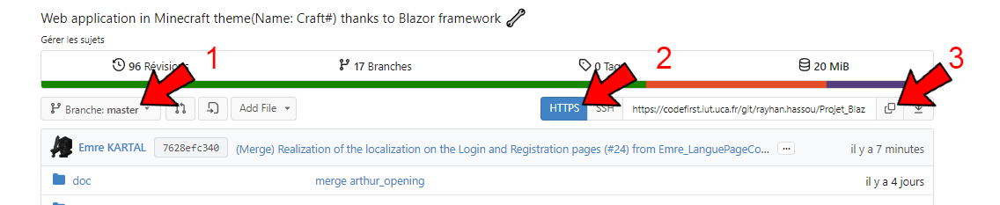

Puis aller sur Visual Studio et cloner en entrant le lien :

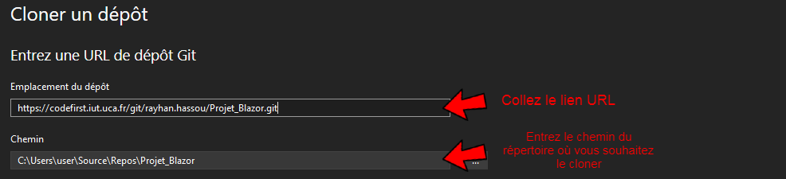

 

:information_source: *Si vous ne disposez pas de Visual Studio, allé sur le site [Microsoft Visual Studio](https://visualstudio.microsoft.com/fr/downloads/) pour pouvoir le télécharger !!!*

 

Une fois cela fait, cliquer sur la solution du projet **CraftSharp.sln**, il devra être normalement affiché en haut à droite de Visual studio :

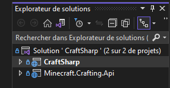

:information_source: *Si ce n'est pas le cas aller dans l'onglet **affichage** puis cliquer sur **Explorateur de solutions**, si le problème persiste recommencer le clone ou vérifier que vous avez la bonne version de Visual studio !!!*

Maintenant il ne reste plus qu'à le lancer ! Pour cela cliquer sur la **Solution** et aller dans les propriétés :

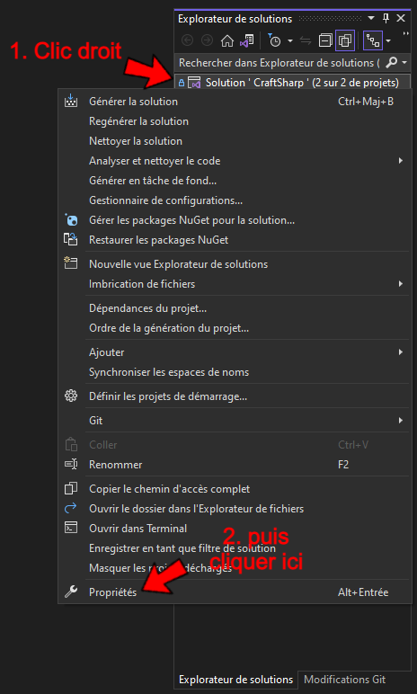

Et pour finir rajouter les modifications suivantes pour lancer les plusieurs projets au démarrage  :

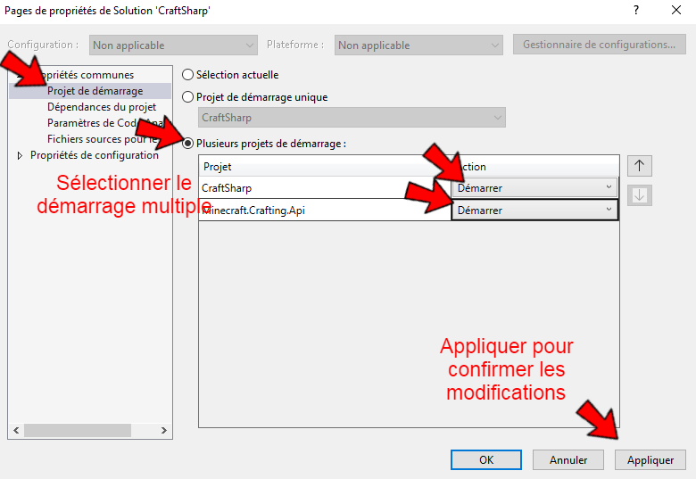

Maintenant il ne reste plus qu'à lancer l'application :satisfied:

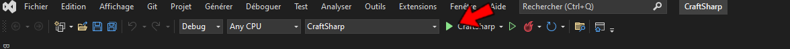

- ### Comment changer la langue ? 

Notre application possède plusieurs langue tel que :

- L'anglais 
- Le français
- Le turc

Si vous êtes plus habilités avec une plus que les autres, vous pouvez la changer dans la page **Connexion** et **Inscription** en cliquant juste en haut en droite de la page : 

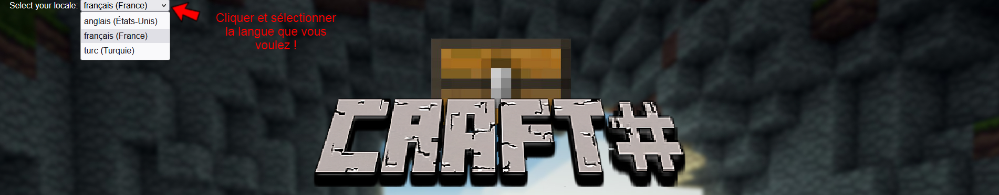

Pour les autres, il se trouvera tout en bas à droite de la page :

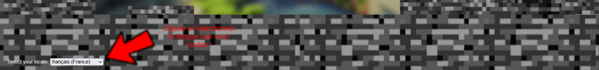

- ### Comment fonctionne l'application ? 

Pas très compliqué! Tout d'abord il est à savoir qu'il existe deux utilisateurs différents avec des droits qui sont aussi différents (Même si ce n'est pas tant que sa): 

- L'utilisateur simple qui s'est inscrit sur l'application via le formulaire d'inscription.
- L'admin enregistrer directement dans l'application (Il n'y a pas de formulaire d'inscription pour être admin), qui lui à en plus la possibilités d'accéder directement avec l'API.

Vous voulez être Admin et profiter pleinement des fonctionnalités de l'Application, voici un compte avec lequel vous pourrez vous connecter:

-**pseudonyme** : Admin

-**Mot de passe** : 123456

En effet on retrouve deux menus différents pour les deux utilisateurs:
- Pour l'utilisateur simple:

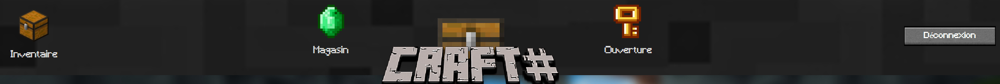

- Pour l'admin:

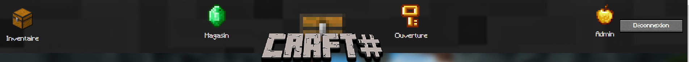

La page **Admin** (qu'y est comme son nom l'indique que pour l'admin) permet de voir tous les items de l'API (et leur spécificités), mais pas seulement il peut si il le souhaite ajouter un nouveau, en supprime un qui ne lui pas plaît modifier, tout cela en navigant simplement et efficacement grâce à une pagination :

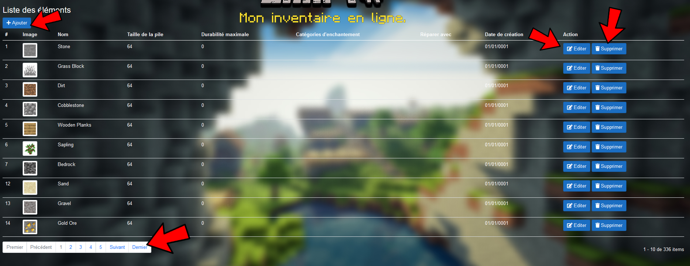

Tandis que pour les autres pages, ils sont les mêmes que celui d'un utilisateur simple !

On retrouve tout d'abord la page **Boutique/Magasin**, un utilisateur lors de son inscription possède déjà *250 Émeraude*, qui sont l'argent nécessaire pour acheter des clés, il peut en acheter soit acheter par 5, par 20 ou bien par 50 :

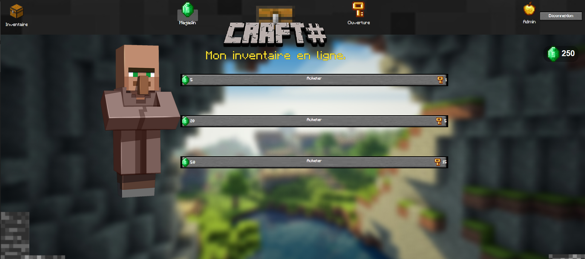

Puis grâce à ces clés qu'il accumule, il peut ouvrir des coffres pour avoir des items (fantastique non?) dans la page **Ouverture** qui se trouve dans le menu :

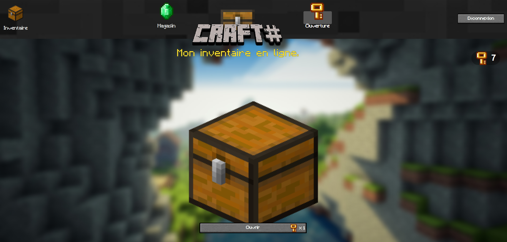

Lorsqu'on clique sur *Ouvrir* (il faut aussi prendre en compte qu'on perd une clé à chaque fois que l'on ouvre un coffre) :

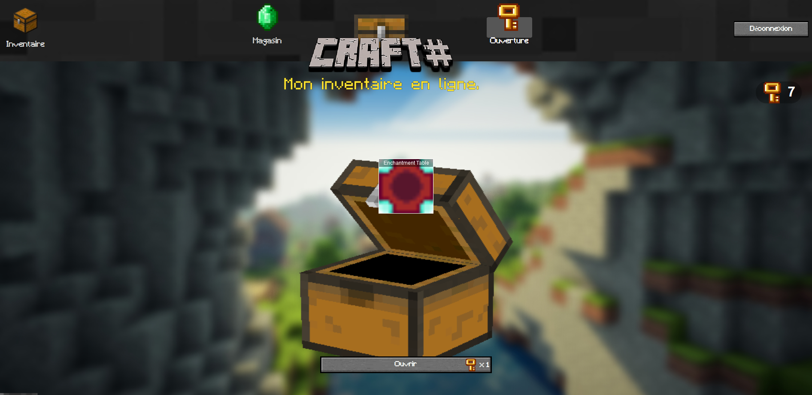

Une fois après avoir eu plein d'items, il peut aller dans la page **Inventaire** situé dans le menu, pour retrouver son inventaire avec tous les items qu'il à accumuler et crafter ce que bon lui semble (Il existe des milliers de combinaisons possible! pour les connaîtres voici un [site](https://fr-minecraft.net/5-aide-crafting-sur-minecraft.php) qui les regroupes tous), il a aussi la possibilités de supprimer un item de son inventaire en glissant l'objet dans la *corbeille*:

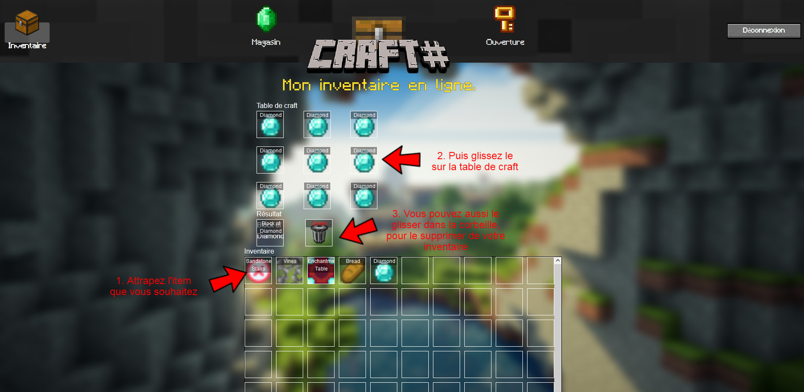

Ai-je vraiment besoin d'expliquer le bouton **Déconnexion** ?!

- ### Gestion des erreurs

Maintenant passons à la gestion des erreurs sur notre application !
 
Commençons par la page **Connexion** et **Inscription**, comme tout bonne application, nous veillons à faire attention :

-A si le pseudonyme qu'on choisit lors de l'inscription n'existe pas :

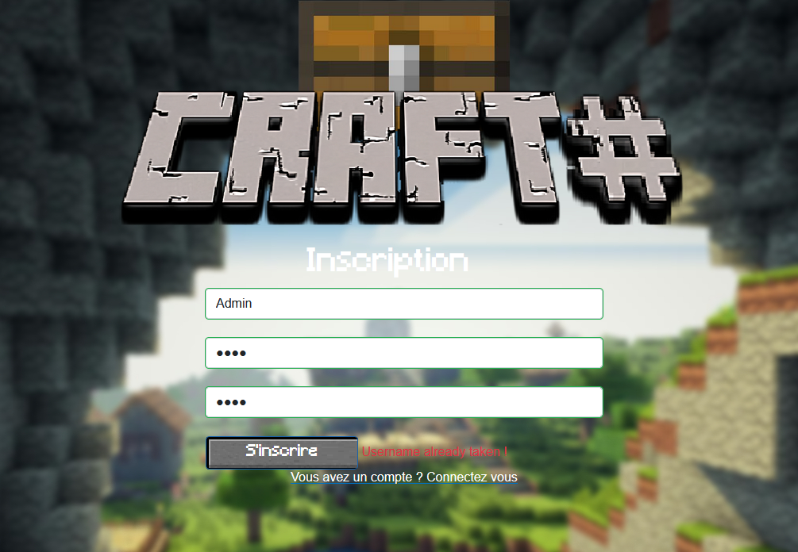

-A vérifier la connexion (En cas de pseudonyme ou mot de passe incorrect) :

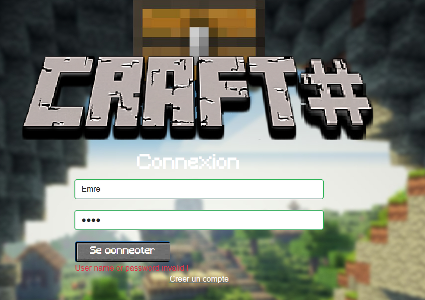

-Mais aussi la taille des élements qu'on rentre lors de l'inscription et la confirmation du mot de passe :

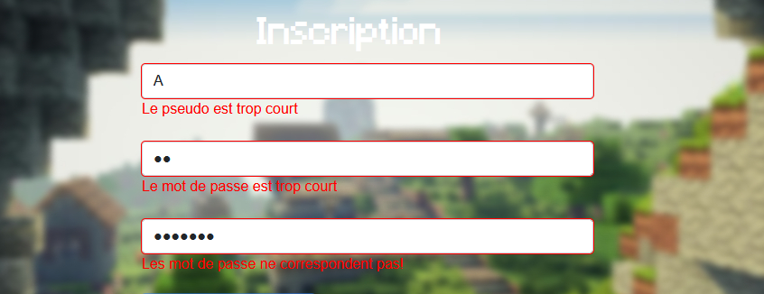

-Une erreur un peu plus spécifique qui a était gérer, est dans le cas où un utilisateur souhaite accéder à une page qui n'existe pas:

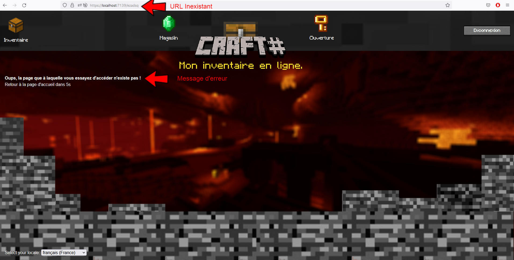

:information_source: Va être alors rédirigé sur une page d'erreur qui au bout de 5secondes le ramènera à la page d'accueil.

# Environnement de Travail

Notre environnement de travail se base sur plusieurs outils :👇

---

&nbsp; 
&nbsp; 
&nbsp; 
&nbsp; 

---

# Technicien en charge de l'application

La composition pour le projet se voit réaliser par trois élèves de l'IUT d'Aubière:
 
⚙️ Emre KARTAL
 
⚙️ Rayhan HASSOU 
 
⚙️ Arthur VALIN 

© Groupe 4

